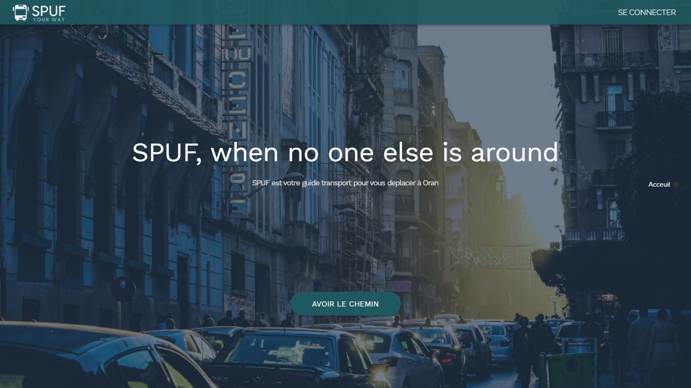
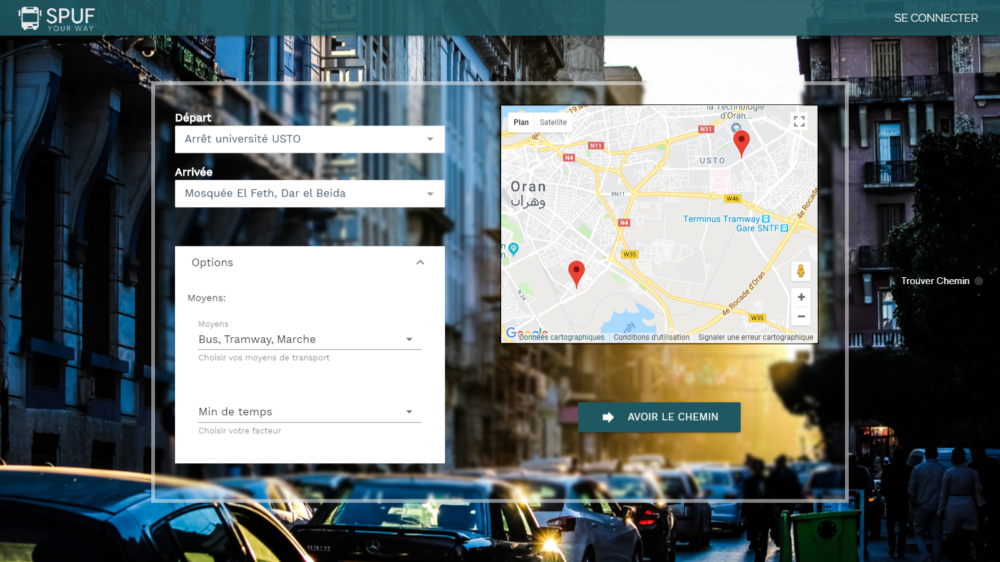
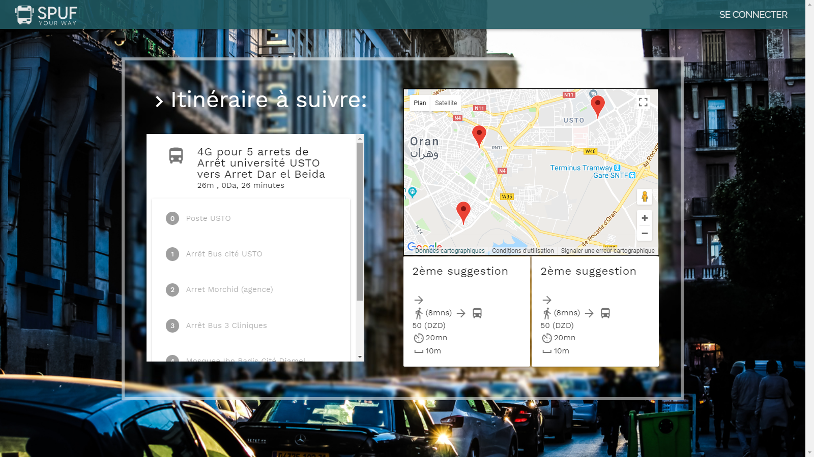
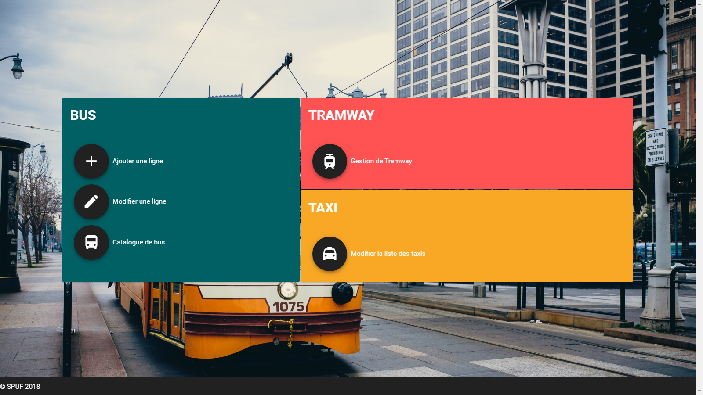
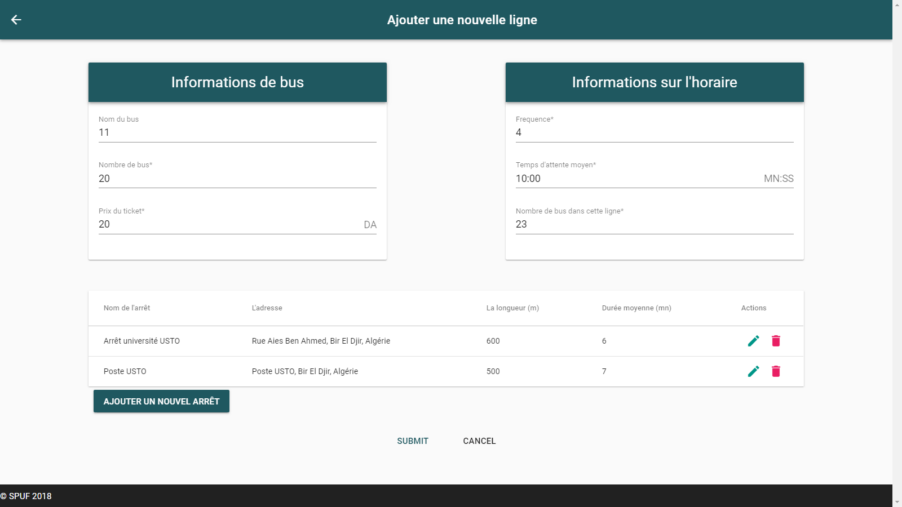

# I still don't have a name for this project but it's nice !

_spuf-314_ is a Web Application _prototype_ for public transportation, serving a RESTful API to find Stations, Bus, Metro and Tramway's Lines, while also computing the best multimodal path between two stations or addresses.

By the way, this was my final year project at the University of Science and Technology of Oran.

Check the API documentation at `{domain}:{port}/api/docs`

## Install

Be sure to have NodeJs v8.11.2 or higher installed, get the latest version at https://nodejs.org/.
open up a terminal and type the following

```
git clone https://github.com/Sakasaky/spuf-314.git
cd spuf-314
npm install
npm run dev # for server
npm run serve-client # to serve client app in app/client
npm run dev-admin  # to serve admin app in app/admin
```

Be sure to add a .env file, or just rename the .env.example for a quick test

## API side TODOs

- Add authentication for client use and admin use
- Implement some security features
- Add subdomain to serve client, API and admin app
- Set up a log system
- Handle errors with correct HTTP status codes

## Tools and Languages:

- Javascript, Javascript everywhere.
- Visual Studio Code.
- [NodeJs](https://nodejs.org) with [ExpressJs](https://expressjs.com/) for the REST API implementation.
- [Neo4J](https://neo4j.com) as the graph database.
- [MongoDB](https://www.mongodb.com/) for document storage.
- [VueJs](https://vuejs.org/) for front end application.

## Screenshots

### HomePage



### RequestPage



### ResponsePage



### AdminHomePage



### AdminAddNewLine


